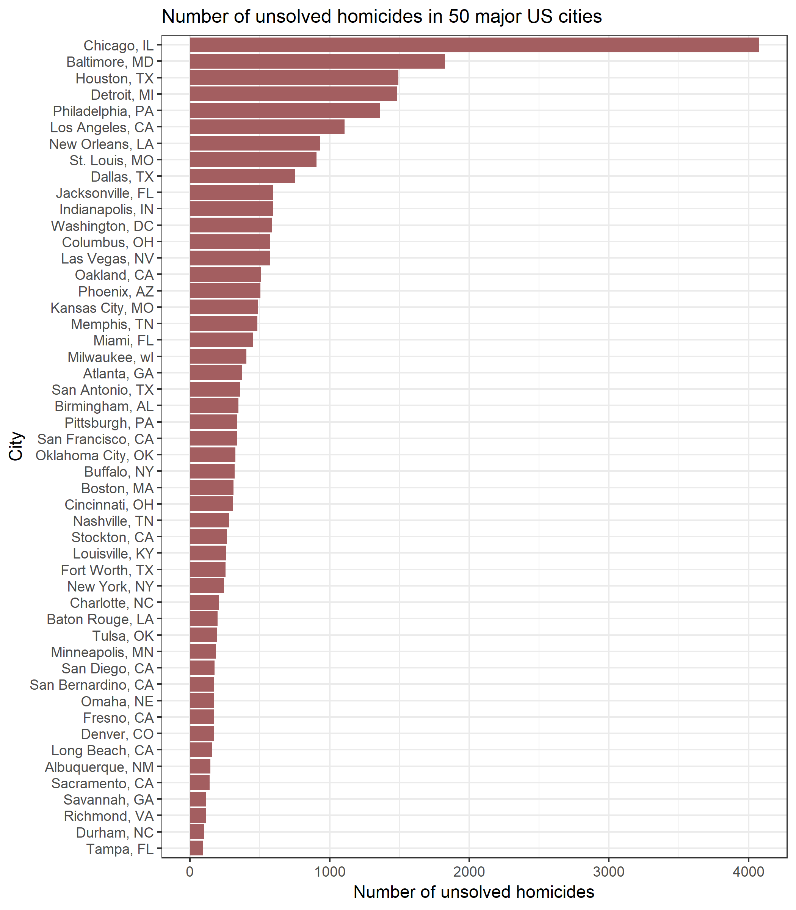

Data Science Homework 5
================

### Problem 1

``` r
file_names <- list.files("./data/", full.names = TRUE)

df <- file_names %>% 
  map(read_csv)

for (i in 1:20) {
  if (i < 11) {
    df[[i]] <- df[[i]] %>% 
    mutate(arm = "Control", 
           study_id = i)
  } else if (i > 10) {
    df[[i]] <- df[[i]] %>% 
      mutate(arm = "Experimental", 
             study_id = i - 10)
  }
}

df <- bind_rows(df) %>% 
  gather(key = week, value = obs, week_1:week_8) %>% 
  arrange(week, study_id) %>% 
  separate(col = week, into = c("delete", "week")) %>% 
  select(-delete)
```

``` r
df %>% 
  mutate(week = as.double(week), 
         study_id = as.character(study_id)) %>% 
  group_by(arm, study_id) %>% 
  ggplot(aes(x = week, y = obs, color = arm, type = study_id)) + 
    geom_line() + 
  theme_bw() + 
  labs(title = "Trend in observations across weeks for each\n participant stratified by study arm",
       x = "Week", 
       y = "Observation") + 
  viridis::scale_color_viridis(name = "Study arm",
                               discrete = TRUE) + 
  theme(legend.position = "bottom", 
        legend.direction = "horizontal", 
        legend.box.spacing = unit(0.05, "cm"),
        plot.title = element_text(size = 11))
```


### Problem 2

``` r
murder <- 
  read_csv("https://raw.githubusercontent.com/washingtonpost/data-homicides/master/homicide-data.csv") %>% 
  janitor::clean_names()
```

``` r
murder <- murder %>% 
  unite("city_state", c("city", "state"), sep = ", ")

unsolved <- murder %>% 
  group_by(city_state) %>% 
  filter(disposition %in% c("Closed without arrest", 
                            "Open/No arrest")) %>% 
  summarize(unsolved = n()) 

total_cases <- murder %>% 
  group_by(city_state) %>%
  summarize(total = n())

all_cases <- left_join(unsolved, total_cases, by = "city_state")
```

``` r
unsolved %>% 
  mutate(city_state = fct_reorder(city_state, unsolved)) %>% 
  ggplot(aes(x = city_state, y = unsolved)) + 
  geom_bar(stat = "identity", fill = "#A35E60") + 
  coord_flip() + 
  labs(title = "Number of unsolved homicides in 50 major US cities", 
       y = "Number of unsolved homicides", 
       x = "City") + 
  theme_bw() + 
  theme(plot.title = element_text(size = 12))
```



``` r
city_nest <- nest(all_cases, unsolved:total)

prop_unsolved <- function(df) {

  ci_unsolved <- prop.test(df$unsolved, df$total)
  
  broom::tidy(ci_unsolved) %>% 
    select(estimate, conf.low, conf.high)
}

city_nest %>% 
  mutate(prop_unsolved = map(city_nest$data, prop_unsolved)) %>% 
  unnest()
```

    ## # A tibble: 50 x 6
    ##    city_state      unsolved total estimate conf.low conf.high
    ##    <chr>              <int> <int>    <dbl>    <dbl>     <dbl>
    ##  1 Albuquerque, NM      146   378    0.386    0.337     0.438
    ##  2 Atlanta, GA          373   973    0.383    0.353     0.415
    ##  3 Baltimore, MD       1825  2827    0.646    0.628     0.663
    ##  4 Baton Rouge, LA      196   424    0.462    0.414     0.511
    ##  5 Birmingham, AL       347   800    0.434    0.399     0.469
    ##  6 Boston, MA           310   614    0.505    0.465     0.545
    ##  7 Buffalo, NY          319   521    0.612    0.569     0.654
    ##  8 Charlotte, NC        206   687    0.300    0.266     0.336
    ##  9 Chicago, IL         4073  5535    0.736    0.724     0.747
    ## 10 Cincinnati, OH       309   694    0.445    0.408     0.483
    ## # ... with 40 more rows

``` r
prop_unsolved(city_nest$data[[1]])
```

    ## # A tibble: 1 x 3
    ##   estimate conf.low conf.high
    ##      <dbl>    <dbl>     <dbl>
    ## 1    0.386    0.337     0.438
